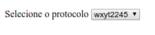

# DECOMP - Técnica de estimativa por decomposição
*Cleuton Sampaio* 2019

```
Copyright 2019 Cleuton Sampaio

Licensed under the Apache License, Version 2.0 (the "License");
you may not use this file except in compliance with the License.
You may obtain a copy of the License at

    http://www.apache.org/licenses/LICENSE-2.0

Unless required by applicable law or agreed to in writing, software
distributed under the License is distributed on an "AS IS" BASIS,
WITHOUT WARRANTIES OR CONDITIONS OF ANY KIND, either express or implied.
See the License for the specific language governing permissions and
limitations under the License.
```

Esta é uma técnica que eu utilizo há algum tempo para estimar atividades de software, sejam novos desenvolvimentos ou solicitações de mudança. Nada há de novidade, apenas os conceitos consagrados que sempre funcionaram.

Se você é adepto dos **métodos ágeis** ou não, realmente não importa. É preciso estimar trabalho de software com as ferramentas adequadas, para evitar problemas. 

O princípio é simples: Decomposição até chegar aos itens elementares de uma solicitação, ou seja, aqueles que podem representar "unidades de trabalho" e, para os quais, você deve fornecer estimativas de esforço. 

## Estimativas de esforço

Estimativa de esforço é uma métrica, dentre muitas, que pode ser utilizada para estimar o tamanho de um serviço pelo qual você deverá cobrar ou pagar. Há outras métricas consagradas, como [**Análise de Pontos de Função**](https://pt.wikipedia.org/wiki/An%C3%A1lise_de_pontos_de_fun%C3%A7%C3%A3o), mais precisas e mais conhecidas. 

O resultado desta técnica é uma estimativa de esforço medida em horas de trabalho, que não significa duração de tarefa. 

Para transformar a estimativa em prazo, é necessário considerar a disponibilidade de recursos para executar as tarefas. 

## Funcionamento

Ao receber uma demanda de mudança, o trabalho consiste em levantar todo o esforço necessário, transformando-o em unidades de tempo. 

Primeiramente, confirma-se a mudança, seja através de protótipo, modelo ou entrevista com o usuário. O importante é levantar quais seriam os critérios para considerar a mudança aprovada e criar testes com isto. 

## Decomposição

Com o entendimento fechado e os critérios preparados, é chegada a hora de decompor o trabalho a ser feito. Eu uso uma hierarquia composta por: 

1. Camada;
2. Aspecto;
3. Artefato;
4. Item.

### Camada

Um software distribuído é composto por diversos ambientes, plataformas e linguagens. Chamamos cada conjunto destes de **camada**. Precisamos saber onde temos que trabalhar para implementar a mudança ou o novo desenvolvimento, por exemplo: Mobile, Frontend, backend, IoT etc.

### Aspecto

A camada pode ter subdivisões estruturais, por exemplo:

    • Frontend: Páginas HTML, Folhas de estilo - CSS, Javascript;
    • Backend: RESTful server, Classe de negócios, Persistência;

### Artefato

Cada aspecto pode ter uma ou mais unidades ou artefatos afetados: Página, Script, Classe, Esquema. É importante mapear o que deve ser feito em cada componente e criar uma tabela de rastreabilidade.

### Item

É o que precisa ser feito em cada artefato para implementar a nova função ou a solicitação de mudança. Mas o que seria um *item*? Sempre há discordância com relação a isto. Um **ITEM** seria: 
- Uma unidade indivisível do trabalho;
- Algo que pode ser feito por apenas uma pessoa;
- Algo que pode ser feito em até 2 horas.

A estimativa começa pelos *itens*, que devem ser estimados de acordo com uma base histórica. Para cada item, pesquisamos o histórico de trabalho e encontramos o que mais se assemelha a ele, anotando a estimativa de esforço. 

Se nada houver na base de histórico, então criamos uma nova entrada, com as estimativas obtidas por consenso entre desenvolvedores, de preferência, com pessoas de fora do Projeto, para evitar *contaminação*. 

O histórico poderia ser algo assim: 

```
Tipo: Consulta paginada
Descrição: Consulta a uma fonte de dados, considerando início e deslocamento, retornando uma lista de itens
Esforço médio: 4 horas (mínimo: 3 horas)
Riscos / fatores complicadores: 
Imagens, necessidade de implementar HATEOAS etc.
```

O importante é sempre manter o histórico devidamente atualizado. Na verdade, após a entrega de cada solicitação, os dados reais são comparados com a base de histórico para atualização ou correção. 

## Etapas da técnica

Usando a técnica **DECOMP**, temos que seguir alguns passos obrigatórios: 

1. **Documentar o antes e prototipar o depois:** Precisamos obter a aprovação formal do Cliente para seguir em frente, e, para isto, precisamos mostrar a ele como entendemos a solicitação de mudança;
2. **Decompor a mudança gerando uma estrutura:** (“top-down”) Este é o núcleo do método, que consiste em decompor a mudança, listando o impacto em cada nível do sistema, até chegar aos itens elementares;
3. **Estimar os itens elementares:** Para cada item elementar, buscamos no histórico quanto tempo demora, se necessita de recursos externos (outras equipes), e qual é o prazo disto. Também incluímos os testes de cada item elementar **[1]**;
4. **Agregar:** (“bottom-up”) É preciso somar o esforço (em unidades de tempo) para cada nível da estrutura;
5. **Conciliar:** Agora, que sabemos qual é o esforço, precisamos saber quanto tempo demorará para entregarmos e quanto nos custará **[2]**. Precisamos ver a disponibilidade dos recursos e conciliar com o esforço calculado, enviando ao Cliente para análise;
6. **Validar e ajustar: Após a conclusão da Solicitação de Mudança, anotamos o tempo real decorrido e registramos no histórico. Se houver discrepância inexplicada, fazemos ajustes no histórico. 

**[1]** Pode ser que não tenhamos a estimativa histórica para cada item elementar. Neste caso, fazemos reuniões rápidas entre desenvolvedores, de preferência de projetos diferentes, para estimar o item. Depois, validamos com o histórico. 

**[2]** Controle de custo está fora deste método de estimativa, que somente verifica o esforço em unidades de tempo. Porém, é fácil converter unidades de tempo em custo, calculando o quanto os recursos ficarão envolvidos com a tarefa. 

# Exemplo de aplicação

Como eu não posso apresentar um caso real, pois violaria a confidencialidade da Empresa, eu modifiquei os dados de um caso real, que eu vivenciei, e que demonstra o valor desta técnica de estimativa. Os dados são totalmente fictícios, mas baseados no referido caso real. 

**Sistema de controle de demandas**

Um sistema web, com frontend HTML 5 e jQuery, e backend REST, em Java, utilizando JPA e banco de dados PostgreSQL. 

Basicamente é uma SPA – Single Page Application e após se identifcar, o usuário tem acesso às demandas e aos protocolos abertos. 

O banco de dados é bem simples, contendo os dados da demanda, que incluem os protocolos de serviços solicitados. Estes protocolos são controlados pelo Sistema de Protocolos, portanto, só os dados básicos estão disponíveis no banco do Sistema de Demandas. 

O backend REST possui várias rotas, tanto para CRUD de recursos relacionados à Demanda, como para consulta aos dados de recursos geridos por outros sistemas, como é o caso dos Protocolos. 

Nós utilizamos um mecanismo de teste [**E2E (End to End test)**](https://www.techopedia.com/definition/7035/end-to-end-test) e sempre incluímos o prazo para modificação do script de teste, ou seja, as estimativas incluem sempre o tempo de confecção de testes. 

## Solicitação de mudança

O Cliente entrou em contato com o desenvolvedor da tela de consulta, solicitando uma alteração: 

"*Eu preciso ver os últimos protocolos e saber o seu estado, para poder cobrar providências ou justificar atrasos. Atualmente, há um ‘combo’ na página de consulta, contendo o código dos protocolos, e ele demora muito a carregar. E eu tenho que selecionar cada protocolo para ver a descrição e preciso consultar outro sistema para saber o estado do protocolo, e isso demora muito.*
*Poderia colocar os 3 protocolos mais recentes na tela, juntamente com a informação de estado? Mantenha o botão para consultar o protocolo completo, e faça uma paginação tipo ‘google’ para ver os outros protocolos.*"

A primeira vista, é algo bem simples de fazer, não requerendo mais do que dois ou três dias para implementar, certo? **Errado!** Este é justamente o erro que o **DECOMP** visa combater!

Ao decompor as alterações necessárias para implementar a mudança, vemos o real **tamanho** do serviço. 

## Documentar o "antes" e prototipar o "depois"

A equipe resistia muito nesta etapa. Insistiam que já sabiam o que o Cliente queria e que não seria necessário. Eu sempre respondi da mesma maneira, dizendo que é como encomendar uma obra ou um móvel sob medida, portanto, precisamos fazer um orçamento minimamente compreensível. 

Eis um recorde da página de consulta como é hoje: 



Este é o tal “combo” que o cliente mencionou. Após selecionar um protocolo, aparecem seus dados e um botão para consultá-lo no Sistema de Protocolos: 


Para saber o estado do protocolo, é necessário clicar no botão “Abrir protocolo”, que o direcionará ao sistema de protocolos. 

O que o Cliente pediu é assim: 


Ao abrir a página de consulta, já aparecem os dados dos três protocolos abertos mais recentemente, incluindo a situação (o estado) de cada um. Note que há uma paginação, que permite ver os protocolos anteriores, cuja a apresentação será a mesma da página inicial. 

Ao clicar no botão “Ver descrição” de um protocolo, aparece uma seção com os dados complementares e o botão para ir para o sistema de protocolo, como é na página atual: 


O cliente deu o “ok” formal no protótipo. 


## Decompor a mudança gerando uma estrutura

Podemos gerar esta estrutura de qualquer maneira. Pode ser uma [**EAP (ou WBS)**](https://pt.wikipedia.org/wiki/Estrutura_anal%C3%ADtica_do_projeto) ou pode ser uma lista hierárquica. Para simplificar, eu geralmente utilizo planilha. Mas pode ser qualquer coisa mesmo. 

### Camadas

Começando pelas camadas, temos que analisar quais mudanças teremos que fazer. Este é um problema que resolvemos só no frontend? Após analisar o código jQuery da página, vimos que não vem o campo “situação” do protocolo, portanto, precisaremos alterar o backend.

1. Frontend;
2. Backend;

### Aspectos

No frontend, teremos que alterar: 
- HTML 5;
- Código jQuery;

No backend, teremos que alterar: 
- RESTful service, para trazer o campo “situação” do protocolo;

Mas, ao analisar o código da classe de negócio associada, as classes de entidade JPA e o banco de dados, vimos que não temos o campo **situação**, e que é preciso recuperá-lo do Sistema de Protocolos! Esta necessidade implica: 
1. Solicitar acesso ao campo “situação”, de outra tabela, do Sistema de Protocolos;
2. Modificar a classe de entidade JPA do “protocolo” para incluir o “join” e o campo;
3. Modificar o teste de integração para considerar o campo “situação” do “protocolo”;
4. Modificar a classe de negócio para retornar o campo “situação” do protocolo;

Então, revisando os aspectos do backend a serem alterados, temos: 
- RESTful service;
- Persistência;
- Entidade JPA;
- Teste de integração;
- Classe de negócio.

Resumindo, temos esta planilha (O link para a planilha completa e definitiva é: [**estrutura.ods**](./estrutura.ods)): 


Agora, precisamos aprofundar um pouco mais. 

### Artefatos

Para cada aspecto, precisamos identificar os artefatos e listar o que é necessário fazer. Já colocamos isso como comentário na planilha, agora, vamos inserir como registros.


Agora, temos uma visão completa de todos os artefatos afetados pela solicitação de mudança, mas precisamos ir mas a fundo, para saber o quê será trabalhado em cada artefato.

### Itens 

Foi muito difícil chegar a um consenso sobre o que seria um “item”. Alguns preferiam granularidade maior, outros, menor. Com o tempo, chegamos a um consenso que nos permitiu estimar com grande precisão: 

“Um item é algo que se pode trabalhar no máximo em 2 horas”;

Porém, só podemos estimar os itens que controlamos. Quanto os itens ou artefatos pertencem a equipe externa, só podemos estimar o nosso esforço em pedir e incluir, além do prazo de atendimento da equipe externa. 

Os itens devem ser pesquisados em nosso histórico. Caso não encontremos nada parecido, precisamos incluir um novo item. Aqui também houve muita discussão, mas temos que ser radicais: Novos itens só se forem bastante diferentes do que já existe. Alguns itens podem ser decompostos e associados a itens que já existem, evitando a criação de novos itens de histórico. 

Por exemplo, veja os itens relativos ao artefato “ConsultaREST.java” (o RESTful service a ser alterado):


Como pode ver, a modificação no artefato “ConsultaREST.java” demandaria 5 horas. Esta unidade de tempo é apenas o esforço necessário, não uma medida de tempo relativa. É preciso considerar a disponibilidade dos recursos e as dependências (quarta coluna). 

## Estimar os itens elementares

Você viu, no tópico anterior, que já coloquei estimativa nos itens elementares. Estas estimativas vieram da base de histórico de itens, já mencionada. Vou repetir o exemplo do que seria essa base: 

```
Tipo: Consulta paginada
Descrição: Consulta a uma fonte de dados, considerando início e deslocamento, retornando uma lista de itens
Esforço médio: 4 horas (mínimo: 3 horas)
Riscos / fatores complicadores: 
Imagens, necessidade de implementar HATEOAS etc.
```

Este histórico foi utilizado para estimar o item “Incluir campo “situação” e controle de paginação”, da classe de negócio. 

Estes itens são estimados e comparados com a realidade (são mantidos os casos históricos). 

Neste exemplo (e no caso real no qual se baseou) não tínhamos estimativa para o item “Solicitar acesso à tabela SituacaoProtocolo ao DBA”, que dependia de equipe externa. Eu conversei com a equipe de DBA e me disseram que, com confirmação do gestor dos dados, em algumas horas eles dariam o acesso. Então, fixamos como 8 horas o prazo, o qual, na realidade, demorou 2 dias. 

## Agregar

Agora é o momento de somar tudo para saber o esforço total: 


Chegamos a um total de 37 horas de esforço (28 para backend e 9 para frontend). Você acha muito? Lembre-se que já está sendo considerado o tempo para confecção / alteração de testes (testes E2E), e também o tempo de disponibilização do acesso a outra tabela externa. 

## Conciliar

Já podemos começar a trabalhar? **Não**! Não temos os recursos alocados para isto!

Agora é o momento da verdade: Quais recursos temos disponíveis para trabalhar na solicitação de mudança?

Para começar, temos atividades em várias camadas, linguagens e plataformas: HTML 5, Javascript (com jQuery), Java, REST, SQL e ferramenta de teste E2E. Vamos supor que a parte HTML / Javascript seja feita por uma equipe externa e, com base na nossa estimativa, eles disseram que trabalharão no projeto 4 horas por dia: 
- 9 horas estimadas, 2 dias de trabalho;

Quanto à parte de persistência, em especial a autorização de acesso, haveria necessidade de criar uma solicitação de mudança para eles, e quem faria isto seria o gestor dos dados (o cliente do outro projeto – Protocolo). Isto demoraria **pelo menos 2 dias**.

Quanto ao resto do Backend, temos 2 desenvolvedores que poderiam atuar full time, porém, precisam de 4 dias para concluir suas tarefas. Precisamos ser conservadores e avaliar o quanto cada desenvolvedor efetivamente trabalhará por dia. Há reuniões, problemas e atrasos, portanto, considerar 6 horas por dia é uma medida sensata. Portanto temos: 
- Horas estimadas (sem considerar a questão do acesso à tabela): 20 horas;
- Dias de trabalho por desenvolvedor: (10 horas, 6 horas por dia): 2 dias;
- Tempo de análise: 1 dia por desenvolvedor;
- Testes de aceitação: 2 dias totais.

**Prazos estimados:**

- Prazo do frontend: 2 dias;
- Prazo do backend: 10 dias (considerando que só começarão 4 dias depois);
- Prazo total, se iniciar agora: **12 dias**.

Eu acrescentei [**reservas gerenciais**](https://pmkb.com.br/artigos/gerenciamento-de-riscos-reservas-de-contingencia-parte-3/) de 2 dias, totalizando **14 dias**. Se não fosse necessário utilizar as reservas, seriam apenas 12 dias.

## Validar e ajustar

Quando dei a estimativa para o Cliente, inclui 2 dias como “reserva gerencial” para imprevistos. E realmente aconteceram: 
- O prazo para a autorização da nova tabela foi de 3 dias;
- Houve problemas no entendimento da demanda e um atraso de 2 dias.

A solicitação foi entregue para testes de aceitação em **15 dias**, ou seja, 1 dia de atraso além das reservas. 

Foram feitos os ajustes no histórico, pois alguns itens demoraram mais do que o previsto. 

## Conclusão

Entregamos muito próximos do prazo que demos (considerando as reservas), o que evitou desgastes com o Cliente e ocupação desnecessária de recursos. Antes deste “sistema” de estimativas, ficávamos com recursos ociosos aguardando a conclusão de outras tarefas. 

Usar um sistema objetivo de estimativas não elimina totalmente os erros, mas os diminui bastante ao longo do tempo, conforme a experiência e o registro histórico vão sendo melhorados. 


